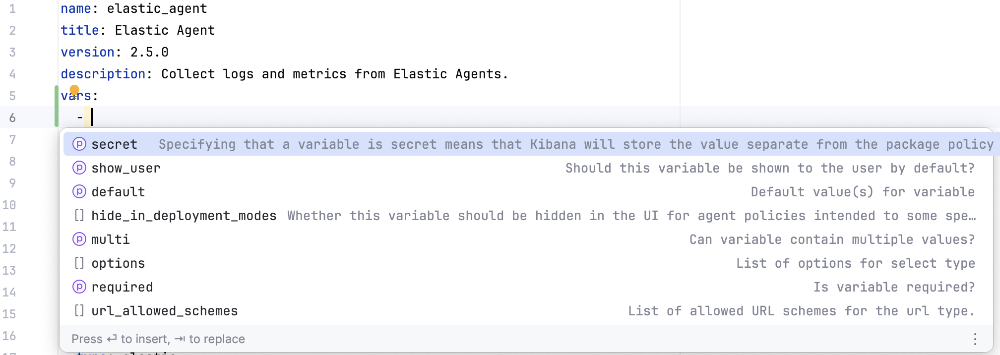

# package-spec-schema

This repository contains [JSON Schema] specifications generated
from [elastic/package-spec]. Each [package-spec release] has its own directory.

## Schema Types

Each directory contains two schema formats:

- **Standard JSON schemas** (`jsonschema/`) - Multi-file schemas with [remote references]
- **IDE bundles** (`bundles/`) - Single-file schemas with embedded dependencies for better [IDE support]

The bundles resolve all remote references and
convert [compound schema documents] to standard `$defs` for better IDE
compatibility.

[JSON Schema]: https://json-schema.org/
[elastic/package-spec]: https://github.com/elastic/package-spec
[package-spec release]: https://github.com/elastic/package-spec/tags
[remote references]: https://json-schema.org/understanding-json-schema/structuring#dollarref
[IDE support]: https://youtrack.jetbrains.com/issue/IJPL-64388/Support-for-YAML-Schema-using-yaml-language-server-comment
[compound schema documents]: https://json-schema.org/understanding-json-schema/structuring#bundling

## IDE Usage

The bundled schema files improve the developer experience when writing
integration packages. You can use the schemas in two ways - comments or IDE
settings.



### yaml-language-server comment

IDEs like IntelliJ and Visual Studio Code recognize
`yaml-language-server` comments in files and load the schema to provide
validation, documentation, and auto-completion.

```yaml
# yaml-language-server: $schema=https://raw.githubusercontent.com/andrewkroh/package-spec-schema/refs/heads/main/3.4.1/bundles/manifest.jsonschema.json
format_version: 3.4.1
name: elastic-agent
title: Elastic Agent
version: "2.5.0"
```

### IDE specific configuration

You can configure associations between file name patterns and JSON schema files
through IDE settings. See the IntelliJ documentation
for [creating JSON schema associations][intellij_schema_association].

For [elastic/integrations][elastic_integrations] development, use these suggested mappings:

| file pattern                                         | schema                                                                                                                                                       |
|------------------------------------------------------|--------------------------------------------------------------------------------------------------------------------------------------------------------------|
| `packages/*/manifest.yml`                            | https://raw.githubusercontent.com/andrewkroh/package-spec-schema/refs/heads/main/3.4.1/bundles/integration/manifest.jsonschema.json                          |
| `packages/*/data_stream/*/manifest.yml`              | https://raw.githubusercontent.com/andrewkroh/package-spec-schema/refs/heads/main/3.4.1/bundles/integration/data_stream/manifest.jsonschema.json              |
| `packages/**/fields/*.yml`                           | https://raw.githubusercontent.com/andrewkroh/package-spec-schema/refs/heads/main/3.4.1/bundles/integration/data_stream/fields/fields.jsonschema.json         |
| `packages/*/elasticsearch/transform/*/transform.yml` | https://raw.githubusercontent.com/andrewkroh/package-spec-schema/refs/heads/main/3.4.1/bundles/integration/elasticsearch/transform/transform.jsonschema.json |
| `packages/*/elasticsearch/transform/*/manifest.yml`  | https://raw.githubusercontent.com/andrewkroh/package-spec-schema/refs/heads/main/3.4.1/bundles/integration/elasticsearch/transform/manifest.jsonschema.json  |
| `packages/**/elasticsearch/ingest_pipeline/*`        | https://raw.githubusercontent.com/andrewkroh/go-ingest-node/refs/heads/main/elasticsearch-ingest-node.schema.json                                            |

[intellij_schema_association]: https://www.jetbrains.com/help/idea/json.html#ws_json_schema_add_custom_procedure
[elastic_integrations]: https://github.com/elastic/integrations

## License

The generated schemas inherit the same license as the source schemas
in [elastic/package-spec]. See the [LICENSE.txt] file.

The source code for generating the schemas (in [.generate/]) is licensed under
the [Apache 2.0 License].

[LICENSE.txt]: LICENSE.txt
[.generate/]: .generate/
[Apache 2.0 License]: .generate/LICENSE.txt

## Resources

- [Package Spec Documentation](https://github.com/elastic/package-spec)
- [JSON Schema Bundling Guide](https://json-schema.org/blog/posts/bundling-json-schema-compound-documents)
- [JSON Schema Specification](https://json-schema.org/specification)
- [Elasticsearch Ingest Node JSON Schema](https://github.com/andrewkroh/go-ingest-node/blob/main/elasticsearch-ingest-node.schema.json)
 